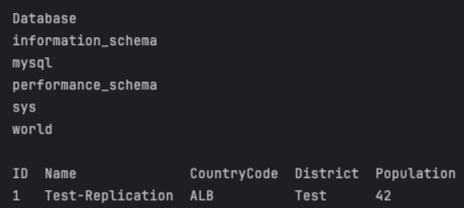
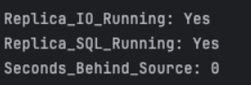
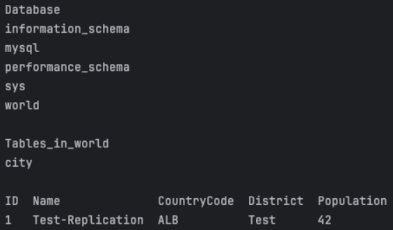

# Домашнее задание к занятию "Репликация и масштабирование. Часть 1" - Еременко Анастасия

---

## Задание 1

**Описать различия между режимами репликации master-slave и master-master.**

**Master-Slave** — запись идёт только на один сервер (master), реплики (slave)
доступны лишь для чтения. Репликация односторонняя (master → slave). Конфликтов
нет, настройка простая, но запись не масштабируется и master — единая точка отказа.

**Master-Master** — запись и чтение возможны на любом из серверов, репликация
двусторонняя (master ↔ master). Нет единой точки отказа и масштабируется запись,
но возможны конфликты записи и настройка сложнее.

| Критерий                | Master-Slave        | Master-Master        |
|-------------------------|---------------------|----------------------|
| Запись                  | Только на master    | На любой узел        |
| Чтение                  | С любого узла       | С любого узла        |
| Направление репликации  | Одностороннее       | Двустороннее         |
| Конфликты записи        | Нет                 | Возможны             |
| Точка отказа на запись  | Есть (master)       | Нет                  |
| Сложность настройки     | Низкая              | Высокая              |
| Масштабирование записи  | Нет                 | Да                   |

---

## Задание 2

### Задание 2
Выполните конфигурацию master-slave репликации, примером можно пользоваться из лекции.

Приложите скриншоты конфигурации, выполнения работы: состояния и режимы работы серверов.

Конфиги:
[master.conf](master.cnf)
[slave.conf](slave.cnf)

SQL:
[master.sql](master.sql)
[slave.sql](slave.sql)

Dockerfile:
[dockerfile_master](Dockerfile_master)
[dockerfile_slave](Dockerfile_slave)

```bash
docker build -t mysql_slave -f ./Dockerfile_slave .
docker build -t mysql_master -f ./Dockerfile_master .
docker network create replication
docker run --name mysql_master --net replication -p 3306:3306 -d mysql_master
docker run --name mysql_slave --net replication -p 3307:3306 -d mysql_slave
```
SQL запросы на master:
```bash
docker exec mysql_master mysql -uroot -p12345 -e "DROP DATABASE IF EXISTS world; CREATE DATABASE world; USE world; CREATE TABLE city (ID INT NOT NULL AUTO_INCREMENT PRIMARY KEY, Name VARCHAR(35) NOT NULL, CountryCode CHAR(3)
  NOT NULL, District VARCHAR(20) NOT NULL, Population INT NOT NULL); INSERT INTO city (Name, CountryCode, District, Population) VALUES ('Test-Replication', 'ALB', 'Test', 42);"
```



SQL запросы на slave:
```bash
docker exec mysql_slave mysql -uroot -p12345 -e "SHOW REPLICA STATUS\G"
```


```bash
docker exec mysql_slave mysql -uroot -p12345 -e "SHOW DATABASES; USE world; SHOW TABLES; SELECT * FROM city ORDER BY ID DESC LIMIT 1;"
```
