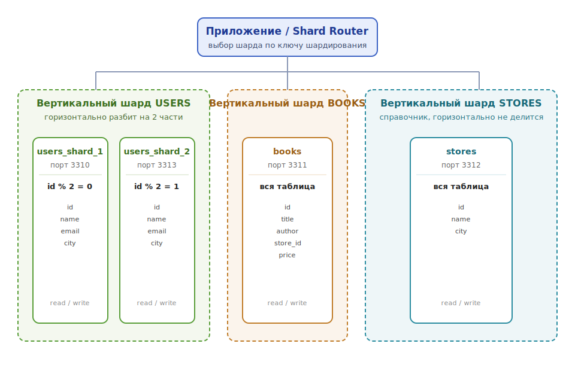

# Домашнее задание к занятию "Репликация и масштабирование. Часть 2" - Еременко Анастасия

---

## Задание 1

**Опишите основные преимущества каждого из подходов к масштабированию:**

**Активный master с пассивным slave (резервная реплика).** Slave работает как
«горячий резерв». Главное — отказоустойчивость: при падении master реплика
содержит актуальную копию и быстро повышается до master (failover). Плюс простота
и согласованность (запись только на одном узле, конфликтов нет) и возможность
снимать бэкапы со slave, не нагружая боевой сервер.

**Один master и несколько slave (read-реплики).** Главное — масштабирование
чтения: нагрузка на `SELECT` распределяется между репликами, пропускная
способность растёт с их числом. Плюс балансировка нагрузки, геораспределение
(реплики ближе к пользователям) и отказоустойчивость чтения (падение одной
реплики не останавливает сервис).

> Кратко: первый подход — про **надёжность** (резерв на случай отказа), второй —
> про **масштабирование чтения**. На практике их совмещают.

---

## Задание 2

**План горизонтального и вертикального шардирования для таблиц `users`,
`books`, `stores`.**

### Структура таблиц

```sql
users  (id, name, email, city)
books  (id, title, author, store_id, price)
stores (id, name, city)
```

### Стратегия шардирования

1. **Вертикальное шардирование (по таблицам / функциональное).**
   Каждая логическая сущность выносится на свой сервер (шард). Это снижает
   взаимную конкуренцию таблиц за ресурсы и позволяет масштабировать «горячие»
   таблицы независимо:
   - сервер **USERS** — таблица `users`;
   - сервер **BOOKS** — таблица `books`;
   - сервер **STORES** — таблица `stores`.

2. **Горизонтальное шардирование (по строкам).**
   Самая нагруженная и быстрорастущая таблица `users` дополнительно разбивается
   по строкам по ключу шардирования `MOD(id, 2)`:
   - **users_shard_1** хранит пользователей с чётным `id` (`id % 2 = 0`);
   - **users_shard_2** хранит пользователей с нечётным `id` (`id % 2 = 1`).

   Маршрутизацией строк к нужному шарду занимается приложение (shard router):
   по `id` пользователя вычисляется остаток от деления и выбирается соединение
   с нужным сервером.

3. **Справочная таблица.** `stores` мала и меняется редко — она не разбивается
   горизонтально и хранится целиком на одном сервере (может реплицироваться на
   остальные как справочник).

### Блок-схема: расположение и содержимое серверов



### Режимы работы серверов

| Сервер          | Тип шардирования            | Содержимое                | Режим       |
|-----------------|-----------------------------|---------------------------|-------------|
| users_shard_1   | вертикальный + горизонтальный | users c `id % 2 = 0`    | read/write  |
| users_shard_2   | вертикальный + горизонтальный | users c `id % 2 = 1`    | read/write  |
| books           | вертикальный                | вся таблица `books`       | read/write  |
| stores          | вертикальный (справочник)   | вся таблица `stores`      | read/write  |

- Каждый шард — самостоятельный сервер записи/чтения для своего диапазона данных.
- Запросы к `users` маршрутизируются по `MOD(id, 2)`; при росте нагрузки число
  горизонтальных шардов можно увеличивать (re-sharding по новому модулю).
- Кросс-шардовые запросы (например, «книги пользователя») выполняются на стороне
  приложения: данные собираются из нужных шардов и объединяются.
